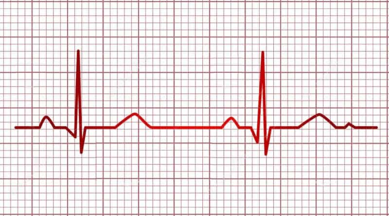

# IntroSenales

## Tabla de contenidos

 1. [Introducción](https://github.com/MateoPortal/IntroSenales/edit/main/README.md#introduccion)
 2. [Miembros del equipo](https://github.com/MateoPortal/IntroSenales/edit/main/README.md#miembros-del-equipo-e10)
 3. [Docentes del curso](https://github.com/MateoPortal/IntroSenales/edit/main/README.md#docentes-del-curso)
 4. [¿Qué es una bioseñal?](https://github.com/MateoPortal/IntroSenales/edit/main/README.md#qu%C3%A9-es-una-biose%C3%B1al)
 5. [Señal de Interés](https://github.com/MateoPortal/IntroSenales/edit/main/README.md#se%C3%B1al-de-inter%C3%A9s)

## Introducción

  

Este curso desarrollará los conocimientos necesarios para el tratamiento de señales provenientes de dispositivos médicos. Se abordaron temas como: el estudio de los sensores, la tecnología de adquisición, los procesos clínicos en los que se dan y protocolos que se usan para compartir la información entre los diferentes equipos que brindan señales. Las clases se desarrollarán en un laboratorio donde se complementará la teoría brindada con simulaciones en computadora utilizando programas desarrollados en Python y kits de desarrollo para la adquisición de bioseñales.

## Docentes del curso: 
- Alonso Cáceres.
- Julissa Venancio.
- Lewis De La Cruz.
- Moises Meza.

## Miembros del equipo E10:
- Aldave Javier, Alessandra Mercedes - alessandra.aldave@upch.pe
- Huaylinos Guerrero, Jose Augusto Modesto 
- Portal Von Hesse, Mateo Luis
- Postigo Yauce, Rosmy Leyla - rosmy.postigo@upch.pe
- Saavedra Barboza, Tayel Christian 
- Salvatierra Guillermo, Diego Paul - diego.salvatierra@pucp.edu.pe

## ¿Qué es una bioseñal?
 

## Señal de interés: 
### __Electrocardiograma (ECG)__
Es una prueba médica que registra la actividad eléctrica del corazón usando electrodos colocados en la piel. Se utiliza para diagnosticar y monitorear diversas afecciones cardíacas, como arritmias, ataques cardíacos e insuficiencia cardíaca. La máquina de ECG registra los impulsos eléctricos generados por el corazón y proporciona una representación visual de la actividad del corazón en forma de gráfico. Un ECG se puede realizar en un consultorio médico, clínica u hospital y es un procedimiento no invasivo e indoloro.

  

